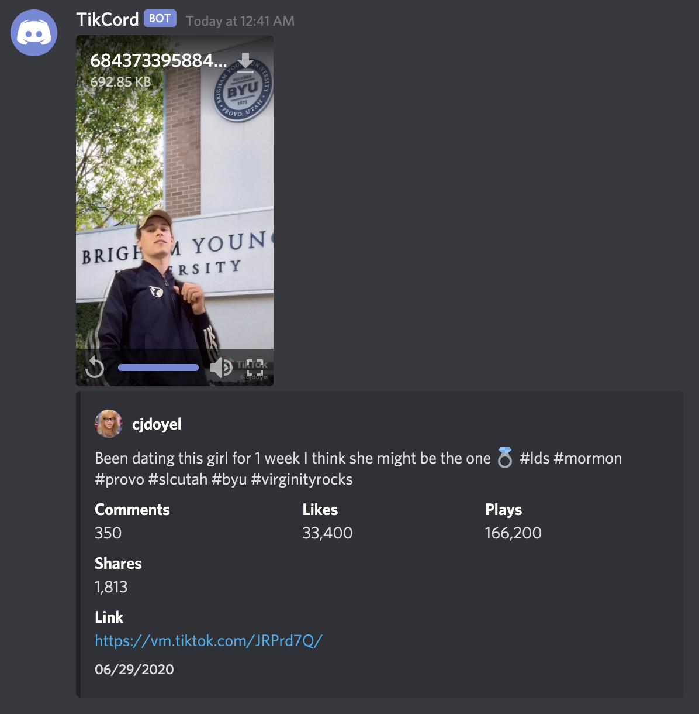

# tikcord

A TikTok download bot for Discord. Simply listens for tiktok.com links in all rooms and, if one is found, sends a message containing the downloaded video and metadata about the video.

# Usage

`./tikcord -t <bot token>` where bot token is a Discord bot token with the Send Messages, Embed Links and Attach Files permissions.

# License

MIT
